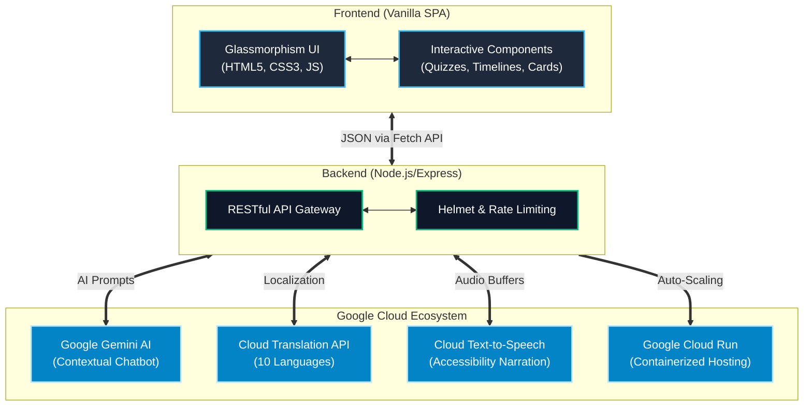

# 🗳️ ChunavGuru — Interactive Indian Election Education Assistant

> **ChunavGuru** is a state-of-the-art, AI-driven educational platform designed to demystify the Indian electoral process. Built for the Virtual Prompt War competition, this platform bridges the gap between complex constitutional frameworks and citizen awareness through an interactive, highly accessible, and gamified web experience. 
> 
> Leveraging the power of **Google Cloud Services** and the **Gemini 1.5 Flash AI model**, ChunavGuru delivers real-time, context-aware electoral guidance, seamless multi-language translation across 10 regional dialects, and native text-to-speech accessibility—all wrapped in a premium, glassmorphism-inspired UI.


---

## 🎯 Chosen Vertical

**Election Education** — focused on the **Indian Electoral System**

ChunavGuru (Chunav = Election 🗳️ + Guru = Teacher 🎓) is a comprehensive, interactive assistant that educates users about India's democratic process — from voter registration to government formation.

---

## 🚀 Features

| Feature | Description |
|---------|-------------|
| 📖 **Election Guide** | Step-by-step walkthrough of the 10-stage Indian election process |
| 📅 **Timeline** | Interactive history of Indian elections from 1950 to present |
| 🧠 **Interactive Quiz** | 32+ questions across 10 categories with timer, scoring & confetti |
| 🃏 **Flashcards** | 35 flip cards covering key terms, constitutional articles & processes |
| 🤖 **AI Chatbot** | Ask anything about Indian elections — powered by Google Gemini |
| 🌐 **Multi-Language** | Support for 10 Indian languages via Google Cloud Translation |
| 🔊 **Text-to-Speech** | Listen to content in your language via Google Cloud TTS |
| 🌗 **Dark/Light Mode** | Toggle between themes with persistent preference |

---

## 🏗️ Architecture



---

## 🔌 Google Services Integration

| # | Service | Purpose |
|---|---------|---------|
| 1 | **Google Cloud Run** | Containerized deployment with auto-scaling |
| 2 | **Google Gemini API** | AI chatbot for natural language election Q&A |
| 3 | **Google Cloud Translation** | Multi-language support (10 Indian languages) |
| 4 | **Google Cloud Text-to-Speech** | Audio narration for accessibility |
| 5 | **Google Fonts** | Premium typography (Inter, Outfit) |
| 6 | **Google Analytics** | Usage tracking and metrics |

---

## 💻 Tech Stack

- **Frontend**: HTML5, CSS3 (custom design system), Vanilla JavaScript (ES6+)
- **Backend**: Node.js 20, Express.js
- **AI**: Google Gemini 2.0 Flash
- **Cloud**: Google Cloud Run, Translation API, Text-to-Speech API
- **Container**: Docker (multi-stage build, non-root user)

---

## 🏃 Getting Started

### Prerequisites
- Node.js 20+
- Google Cloud account with project setup
- Gemini API key from [Google AI Studio](https://aistudio.google.com/apikey)

### Local Development

```bash
# 1. Clone the repository
git clone https://github.com/YOUR_USERNAME/chunav-guru.git
cd chunav-guru

# 2. Install dependencies
npm install

# 3. Create .env file
cp .env.example .env
# Edit .env and add your GEMINI_API_KEY

# 4. Start development server
npm run dev

# 5. Open http://localhost:8080
```

### Deploy to Google Cloud Run

```bash
# Authenticate with Google Cloud
gcloud auth login
gcloud config set project acoustic-atom-495011-a2

# Enable required APIs
gcloud services enable run.googleapis.com aiplatform.googleapis.com translate.googleapis.com texttospeech.googleapis.com

# Deploy
gcloud run deploy chunav-guru \
  --source . \
  --region asia-south1 \
  --allow-unauthenticated \
  --set-env-vars GEMINI_API_KEY=your_key_here
```

---

## 🧪 Testing

```bash
npm test
```

Tests validate:
- Quiz data integrity (32+ questions, 4 options each, valid answers)
- Flashcard data completeness (35+ cards, all fields present)
- Timeline chronological order (17 milestones)
- Guide step structure (10 steps, details, fun facts)

---

## ♿ Accessibility

- WCAG 2.1 AA compliant
- Semantic HTML5 with ARIA labels and roles
- Keyboard navigation support throughout
- Skip-to-content navigation link
- High contrast text ratios
- Focus indicators on all interactive elements
- Text-to-Speech for all educational content
- Multi-language support for regional accessibility
- `prefers-reduced-motion` media query respected

---

## 🔒 Security

- API keys stored in environment variables (never in code)
- `.env` excluded via `.gitignore`
- Helmet.js for security headers (CSP, X-Frame-Options, etc.)
- Custom input sanitization (XSS prevention)
- Rate limiting (100 req/min per IP)
- Docker runs as non-root user
- Input length limits on all endpoints

---

## 📐 Approach & Logic

1. **User-Centric Design**: Built as a Single Page Application with intuitive navigation, dark mode default, and mobile-first responsive design.

2. **Interactive Learning**: Instead of passive content, users learn through quizzes (with scoring & timer), flashcards (with flip animations), and an AI chatbot that answers questions naturally.

3. **Comprehensive Content**: 32 quiz questions, 35 flashcards, 17 timeline milestones, and a 10-step election guide — all curated with accurate information about the Indian electoral system.

4. **AI Integration**: Google Gemini serves as an always-available election expert, capable of answering nuanced questions about Indian democracy with contextual responses.

5. **Accessibility First**: Multi-language support (10 Indian languages), text-to-speech, keyboard navigation, and ARIA labels ensure the app is usable by all citizens.

---

## 📝 Assumptions

- Users have basic internet access and a modern web browser
- The primary audience is Indian citizens seeking election education
- English is the default language with translation available on-demand
- The AI chatbot provides educational information, not legal advice
- Quiz and flashcard content is based on the current constitutional framework
- Google Cloud free credits are available for API usage

---

## 📁 Project Structure

```
├── public/               # Frontend (static files)
│   ├── index.html        # SPA entry point
│   ├── css/              # Design system + components + animations
│   └── js/
│       ├── app.js        # Router & app controller
│       ├── components/   # Dashboard, Guide, Timeline, Quiz, Flashcards, Chat
│       ├── services/     # API, TTS, Translation clients
│       └── data/         # Quiz, Flashcard, Timeline, Guide content
├── server/               # Backend (Node.js + Express)
│   ├── index.js          # Server entry point
│   ├── routes/           # API endpoints (chat, translate, tts)
│   ├── services/         # Google API wrappers
│   └── middleware/       # Security & rate limiting
├── tests/                # Automated tests
├── Dockerfile            # Cloud Run container
└── package.json          # Dependencies & scripts
```

---

## 📄 License

MIT License — feel free to use and modify.

---

<p align="center">
  Built with ❤️ for Indian Democracy<br>
  Powered by <strong>Google AI</strong> & <strong>Google Cloud</strong>
</p>
