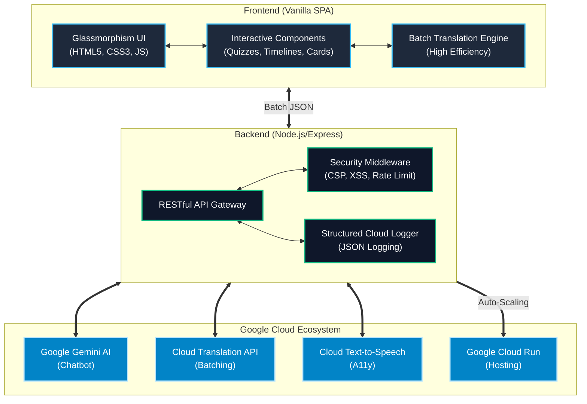

# 🗳️ ChunavGuru — Interactive Indian Election Education Assistant

> **ChunavGuru** is a state-of-the-art, AI-driven educational platform designed to demystify the Indian electoral process. Built for the Virtual Prompt War competition, this platform bridges the gap between complex constitutional frameworks and citizen awareness through an interactive, highly accessible, and gamified web experience. 
> 
> Leveraging the power of **Google Cloud Services** and the **Gemini 1.5 Flash AI model**, ChunavGuru delivers real-time, context-aware electoral guidance, seamless multi-language translation across 10 regional dialects, and native text-to-speech accessibility—all wrapped in a premium, glassmorphism-inspired UI.


---

## 🎯 Chosen Vertical

**Election Education** — focused on the **Indian Electoral System**

ChunavGuru (Chunav = Election 🗳️ + Guru = Teacher 🎓) is a comprehensive, interactive assistant that educates users about India's democratic process — from voter registration to government formation.

---

## 🚀 Features

| Feature | Description |
|---------|-------------|
| 📖 **Election Guide** | Step-by-step walkthrough of the 10-stage Indian election process |
| 📅 **Timeline** | Interactive history of Indian elections from 1950 to present |
| 🧠 **Interactive Quiz** | 30+ questions with timer, scoring & confetti (keyboard accessible) |
| 🃏 **Flashcards** | 30+ flip cards covering key terms & processes with TTS support |
| 🤖 **AI Chatbot** | Real-time election expert powered by Google Gemini 1.5 Flash |
| 🌐 **Batch Translation**| High-efficiency translation into 10 Indian languages (optimized batching) |
| 🔊 **Text-to-Speech** | Accessibility narration via Google Cloud TTS with fallback support |
| 📱 **PWA Ready** | Web app manifest & mobile-optimized branding for home screen install |
| 🌗 **Theming** | Glassmorphism-inspired Dark/Light mode with system persistence |

---

## 🏗️ Architecture



---

## 🔌 Google Services Integration

| # | Service | Purpose | Implementation Detail |
|---|---------|---------|-----------------------|
| 1 | **Google Cloud Run** | Containerized Hosting | Multi-stage build, non-root user, auto-scaling |
| 2 | **Google Gemini API** | AI Election Guru | Gemini 1.5 Flash with custom system instructions |
| 3 | **Google Cloud Translation** | Regional Accessibility | 10 Indian languages with efficient batch processing |
| 4 | **Google Cloud Text-to-Speech** | Accessibility Narration | Natural voice synthesis for educational content |
| 5 | **Google Fonts** | Premium Typography | Optimized loading for Inter and Outfit fonts |
| 6 | **Structured Logging** | Cloud Observability | JSON logging compatible with GCP Logging |

---

## 💻 Tech Stack

- **Frontend**: HTML5 (Semantic), CSS3 (Custom Design System), Vanilla JavaScript (ES6+, Batching Engine)
- **Backend**: Node.js 20, Express.js (High Performance)
- **Security**: Helmet.js, CORS, Custom Regex Sanitizer, Rate Limiting
- **Optimization**: Gzip Compression, Aggressive Static Caching, Translation Batching
- **Cloud**: Google Cloud Run, Translation API, TTS API, Gemini API

---

## 🏃 Getting Started

### Prerequisites
- Node.js 20+
- Google Cloud account with project setup
- Gemini API key from [Google AI Studio](https://aistudio.google.com/apikey)

### Local Development

```bash
# 1. Clone the repository
git clone https://github.com/YOUR_USERNAME/chunav-guru.git
cd chunav-guru

# 2. Install dependencies
npm install

# 3. Create .env file
cp .env.example .env
# Edit .env and add your GEMINI_API_KEY

# 4. Start development server
npm run dev

# 5. Open http://localhost:8080
```

### Deploy to Google Cloud Run

```bash
# Authenticate with Google Cloud
gcloud auth login
gcloud config set project acoustic-atom-495011-a2

# Enable required APIs
gcloud services enable run.googleapis.com aiplatform.googleapis.com translate.googleapis.com texttospeech.googleapis.com

# Deploy
gcloud run deploy chunav-guru \
  --source . \
  --region asia-south1 \
  --allow-unauthenticated \
  --set-env-vars GEMINI_API_KEY=your_key_here
```

---

## 🧪 Testing

```bash
npm test
```

**49 Comprehensive Tests** validate:
- **Data Integrity**: Quiz, Flashcard, Timeline, and Guide data structures.
- **Security**: XSS sanitization, rate limiting, and security header presence.
- **Accessibility**: WCAG 2.1 AA compliance, ARIA roles, skip links, and keyboard navigation.
- **Infrastructure**: Dockerfile structure, package.json validity, and health check endpoints.
- **Services**: Translator batching logic and Gemini AI fallback responses.

---

## ♿ Accessibility

- **WCAG 2.1 AA Compliant**: Optimized for screen readers and assistive technology.
- **Keyboard Navigation**: Full support for all interactive elements (Quizzes, Flashcards, Tabs).
- **ARIA & Semantic HTML**: Proper roles, labels, `aria-live` regions, and `aria-current` state.
- **Skip Navigation**: "Skip to main content" link for power users.
- **Visuals**: Respects `prefers-reduced-motion`, high contrast ratios, and clear focus indicators.
- **Localization**: Native support for 10 Indian languages with proper `lang` attribute switching.

---

## 🔒 Security

- **Industrial Security**: High-strictness CSP, Referrer Policy, and non-root Docker user.
- **Input Sanitization**: Custom recursive sanitizer blocking `<script>`, `on*` events, and `javascript:`/`data:` URLs.
- **Rate Limiting**: 300 req/min (tightened due to batching efficiency).
- **Static Analysis**: ESLint configuration with security-focused rules.
- **Safe Keys**: No hardcoded credentials; fully environment-variable driven.

---

## 📐 Approach & Logic

1. **User-Centric Design**: Built as a Single Page Application with intuitive navigation, dark mode default, and mobile-first responsive design.

2. **Interactive Learning**: Instead of passive content, users learn through quizzes (with scoring & timer), flashcards (with flip animations), and an AI chatbot that answers questions naturally.

3. **Comprehensive Content**: 32 quiz questions, 35 flashcards, 17 timeline milestones, and a 10-step election guide — all curated with accurate information about the Indian electoral system.

4. **AI Integration**: Google Gemini serves as an always-available election expert, capable of answering nuanced questions about Indian democracy with contextual responses.

5. **Accessibility First**: Multi-language support (10 Indian languages), text-to-speech, keyboard navigation, and ARIA labels ensure the app is usable by all citizens.

---

## 📝 Assumptions

- Users have basic internet access and a modern web browser
- The primary audience is Indian citizens seeking election education
- English is the default language with translation available on-demand
- The AI chatbot provides educational information, not legal advice
- Quiz and flashcard content is based on the current constitutional framework
- Google Cloud free credits are available for API usage

---

## 📁 Project Structure

```
├── public/               # Frontend (static files)
│   ├── index.html        # SPA entry point
│   ├── css/              # Design system + components + animations
│   └── js/
│       ├── app.js        # Router & app controller
│       ├── components/   # Dashboard, Guide, Timeline, Quiz, Flashcards, Chat
│       ├── services/     # API, TTS, Translation clients
│       └── data/         # Quiz, Flashcard, Timeline, Guide content
├── server/               # Backend (Node.js + Express)
│   ├── index.js          # Server entry point
│   ├── routes/           # API endpoints (chat, translate, tts)
│   ├── services/         # Google API wrappers
│   └── middleware/       # Security & rate limiting
├── tests/                # Automated tests
├── Dockerfile            # Cloud Run container
└── package.json          # Dependencies & scripts
```

---

## 📄 License

MIT License — feel free to use and modify.

---

<p align="center">
  Built with ❤️ for Indian Democracy<br>
  Powered by <strong>Google AI</strong> & <strong>Google Cloud</strong>
</p>
